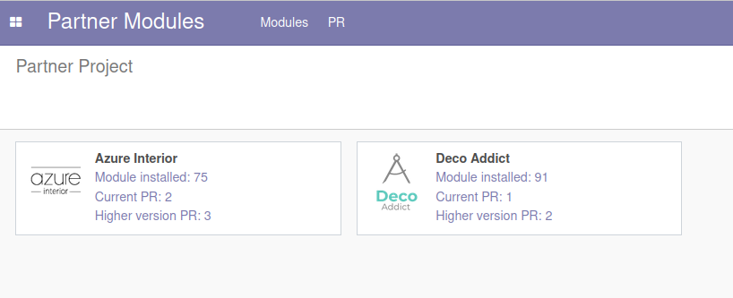

<!-- /!\ Non OCA Context : Set here the badge of your runbot / runboat instance. -->

<!-- /!\ Non OCA Context : Set here the badge of your translation instance. -->

<!-- /!\ do not modify above this line -->

# Partner Module Information

Repo for managing odoo modules and follow migration by project

This repo allow you to :

- Synchronise module information with a list of community module https://github.com/akretion/odoo-module-tracker/blob/gh-pages/
- Synchronise the PR state with github api
- Push module's informations from remote Odoo
- See in one kanban the PRs in current and higher version who can impact your projects
- Attach a timesheet to a PR review to report your reviewer time
- Follow migration goal for partner project (in progress)

<!-- /!\ do not modify below this line -->

<!-- prettier-ignore-start -->

[//]: # (addons)

Available addons
----------------
addon | version | maintainers | summary
--- | --- | --- | ---
[module_info_import](module_info_import/) | 14.0.1.0.0 |  | Get information about modules from akretion/odoo-module-tracker
[module_info_migration](module_info_migration/) | 14.0.1.0.0 |  | Module Info Migration
[module_info_partner](module_info_partner/) | 14.0.0.0.0 |  | Information about odoo modules used by your partners
[module_info_pull_request](module_info_pull_request/) | 14.0.0.0.0 |  | Information about Pull Request state on modules
[module_info_pull_request_timesheet](module_info_pull_request_timesheet/) | 14.0.0.0.0 |  | Add timesheet to Pull request
[module_info_push](module_info_push/) | 14.0.1.0.0 |  | Send information about installed module in the database

[//]: # (end addons)

<!-- prettier-ignore-end -->

## Licenses

This repository is licensed under [AGPL-3.0](LICENSE).

However, each module can have a totally different license, as long as they adhere to Akretion
policy. Consult each module's `__manifest__.py` file, which contains a `license` key
that explains its license.

----
<!-- /!\ Non OCA Context : Set here the full description of your organization. -->
